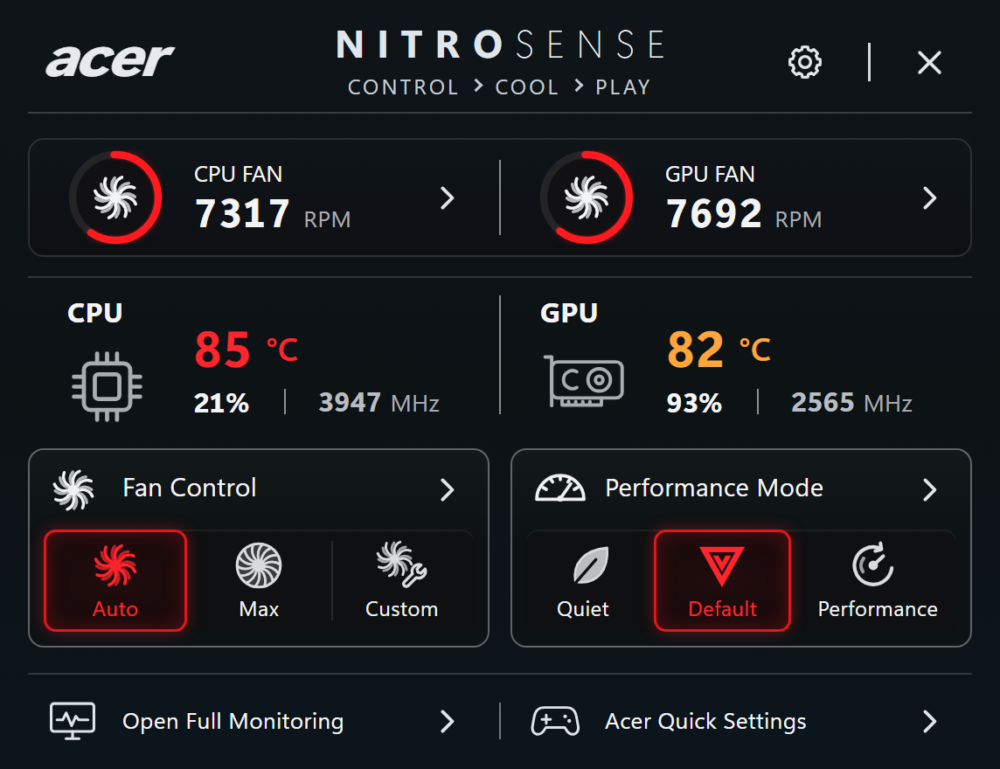
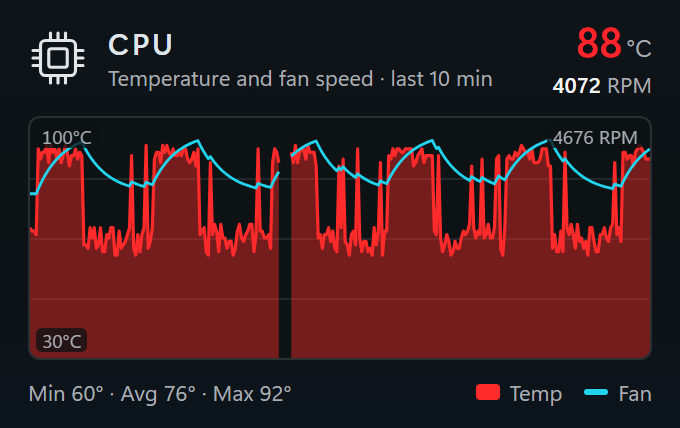
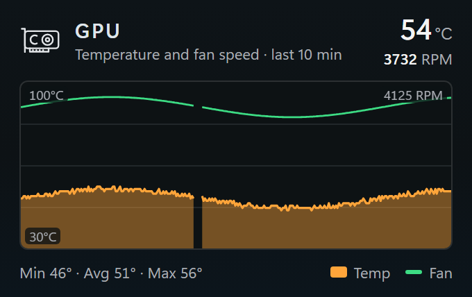

# NitroTray

A compact Windows tray companion for **Acer NitroSense**. It exposes the controls and telemetry you actually
need, CPU/GPU temperature, load and clock, fan RPM, Auto/Max/Custom fan modes and Quiet/Default/Performance,
without opening the full NitroSense app. It also puts **System Informer–style graph icons** for CPU and GPU
(temperature + fan-speed history) in the notification area.



Built and verified on an **Acer Nitro AN515-58** (i7-12650H, RTX 4060).

## Features

- **Popup** (left-click the tray icon, or **Win+Alt+N**): a rounded, notch-free flyout anchored to the tray on
  any taskbar edge; closes on Escape, the × button or clicking elsewhere; stays instantiated so it reopens
  instantly. Styled after the NitroSense reference, laid out on one alignment grid.
- **Telemetry**: CPU/GPU temperature (Acer firmware), utilisation and clock (Windows PDH / NVIDIA NVML),
  fan RPM (firmware). Missing data shows `--` or "Unavailable" and is never invented.
- **Controls**: fan Auto / Max / Custom and performance Quiet / Default / Performance, each verified by
  reading the firmware back. Unsupported options are shown disabled with the reason.
- **Custom fan curves**: editor with drag handles, 20 % duty floor, 100 % at ≥ 90 °C, fail-safe to Auto.
- **Graph tray icons**: separate CPU and GPU icons, each drawing temperature (filled) and fan speed (line)
  history. Colours, series, fill, temperature range and fan scale are configurable per icon.
- **Hover details**: rest the pointer on the CPU or GPU icon for a flyout with that icon's history drawn
  large, the current temperature and fan speed, and min/avg/max over the window.
- **Full monitoring** window (5-minute charts), **settings**, **diagnostics export**.


*Tray icons as the notification area draws them: CPU temperature (red fill) with fan speed (cyan), GPU (orange
with green), then the app icon. Rendered by the icon code itself; a unit test keeps the image current.*

| Hover the CPU icon | Hover the GPU icon |
|---|---|
|  |  |

*Hover flyouts (2x), with sample history shaped like the AN515-58's readings: CPU bursts between about 60
and 92 °C under light load while the GPU stays in the 50s.*

## How it works

NitroSense drives the Acer gaming firmware through the WMI class `AcerGamingFunction`. That class refuses
normal users, so NitroTray is split in two:

| Process | Runs as | Does |
|---|---|---|
| `NitroTray.exe` | you | tray icons, popup, windows, OS telemetry |
| `NitroTrayService.exe` | LocalSystem service, installed to `%ProgramFiles%\NitroTray` | six typed commands over an ACL-restricted local pipe; no generic hardware access |

Without the helper the app still runs: OS telemetry works and every hardware control is shown read-only.
Details: [docs/architecture.md](docs/architecture.md), [docs/acer-discovery.md](docs/acer-discovery.md).

## Install

Requirements: 64-bit Windows 10 or 11 and the WebView2 Runtime (preinstalled on Windows 11; setup warns
if it is missing).

Download `NitroTray-<version>-setup.exe` and `SHA256SUMS.txt` from the repository's
[Releases](https://github.com/st0nebridge/NitroTray/releases) page, check the hash, and run setup. It asks
for administrator rights once and installs into `%ProgramFiles%\NitroTray`:

| Component | Default | What it does |
|---|---|---|
| NitroTray | always | the tray app, a Start menu shortcut and an entry in *Settings › Apps* |
| Helper service | on | registers `NitroTrayHelper` (LocalSystem, automatic start) for firmware telemetry and controls |
| Start with Windows | on | adds NitroTray to your sign-in apps |

The folder cannot be changed: the helper runs as SYSTEM, so its binary only ever lives where administrators
alone can write. Running a newer setup upgrades in place and keeps the components you have; untick one to
remove it. Uninstall from *Settings › Apps*; it asks whether to delete your settings
(`%LOCALAPPDATA%\NitroTray`). A silent uninstall keeps them.

| Unattended | Command |
|---|---|
| Install | `NitroTray-<version>-setup.exe /S [/NOHELPER] [/NOAUTOSTART]` |
| Uninstall | `"%ProgramFiles%\NitroTray\Uninstall.exe" /S` |

Windows 11 may place new tray icons in the overflow flyout. Use **Settings › Integration › Show icons on
taskbar**, or drag them out yourself.

> **Unsigned builds and Microsoft Defender.** Setup and the binaries are not code-signed, so SmartScreen
> may say *Unknown publisher*. On the development machine Defender's ASR rule *"Use advanced protection
> against ransomware"* (C1DB55AB-…) blocked some freshly built `NitroTray.exe` binaries (Event 1121). Sign
> release builds, or add an ASR exclusion for the install folder yourself if you accept that trade-off.
> NitroTray does not change Defender settings.

### Build the installer from source

Requirements: Rust 1.85+ (MSVC), Node 22+ (for the UI tests) and NSIS 3 (`winget install NSIS.NSIS`).

```bash
powershell -NoProfile -ExecutionPolicy Bypass -File bin/package.ps1
```

This builds both executables in release mode and writes `dist/NitroTray-<version>-setup.exe` plus
`dist/SHA256SUMS.txt`.

## Usage

| Action | How |
|---|---|
| Open / close popup | left-click a NitroTray tray icon, or Win+Alt+N |
| CPU / GPU history | hover the CPU or GPU tray icon (*Settings › Tray icons › Details on hover*) |
| Tray menu | right-click: Open, Performance Mode ›, Fan Mode ›, Full Monitoring, Settings, Open NitroSense, Start with Windows, Exit |
| Fan curve editor | Fan Control header or a fan cell; *Custom* opens it when no curve is saved |
| Exit from a script | `NitroTray.exe --exit` |
| Helper CLI | `NitroTrayService.exe <run \| console [--simulate] [--pipe NAME] \| install \| uninstall>` |

Settings live in `%LOCALAPPDATA%\NitroTray\config.json`. Modes are never re-applied at boot unless you
enable *Settings › Startup › Re-apply last modes*.

## Project structure

```text
src/
  main.rs, bin/nitrotray_service.rs   entry points
  app/        bootstrap, events, runtime, surfaces, effects, model (pure), worker, tray_host, hotkeys
  acer/       acpi (bit codec), gaming, wmi, discovery, backend, error, nitrosense, services
  service/    core, curve, worker, host, cli, install_path, simulated (dev only)
  ipc/        protocol, pipe, client
  telemetry/  collector, cpu (PDH), gpu (NVML), fan, history, scheduler, snapshot, thresholds
  tray/       positioning, raster, graph_icon, app_icon, menu
  ui/         bridge, assets, webview, web/ (popup + window HTML/CSS/JS)
  config/     settings, hotkey, store
  platform/   windows, power, signal, tray_prefs
  installer/  NSIS script and setup icon
tests/unit (Rust), tests/regression (one per behaviour change), tests/ui (node:test + jsdom, preview pages),
tests/installer (elevated install/upgrade/uninstall round trip)
bin/        build, test, package, dev-run, ui-snap, devserver
docs/       architecture, acer-discovery, images
```

## Development

```bash
powershell -NoProfile -ExecutionPolicy Bypass -File bin/test.ps1
```

```bash
powershell -NoProfile -ExecutionPolicy Bypass -File bin/dev-run.ps1
```

`dev-run.ps1` runs the tray against a **simulated** helper on a private pipe and config folder. `-Real` runs
the helper elevated via gsudo against the firmware; `-Stop` shuts both down. `bin/ui-snap.ps1` renders the
popup (`-View popup`) or a hover flyout (`-View flyout-cpu|flyout-gpu`) with headless Edge at 2x into
`reports/ui/`, the source of `docs/images/*@2x.png`; `tests/ui/preview/compare.html` diffs the popup
against a NitroSense screenshot, which is not distributed: save your own at
`docs/reference/nitrosense-compact-reference.webp` (2x scale). `docs/images/tray-icons@6x.png` is written by `docs_images_test` with
`NITROTRAY_WRITE_FIXTURES=1`.
UI goldens in `tests/ui/fixtures/snapshots` are rewritten only with `NITROTRAY_WRITE_FIXTURES=1`, after
reviewing the rendered change.

Live firmware tests are opt-in: `hardware_test` (read-only, run elevated) and `live_control_test`
(`NITROTRAY_LIVE_PIPE=\\.\pipe\...` pointing at an elevated console helper; it always restores the
original modes).

The installer round trip is opt-in too. It needs a machine where NitroTray is not installed, runs elevated
and leaves nothing installed: fresh install, upgrade over the running helper, uninstall, then a
`/NOHELPER /NOAUTOSTART` install and its uninstall, with service, pipe, registry and folder-ACL checks.

```bash
gsudo powershell -NoProfile -ExecutionPolicy Bypass -File tests/installer/roundtrip.ps1
```

The live webview check runs a release build in isolated instances (own config, WebView2 folder and
DevTools port) and confirms the popup and hover-flyout pages load and the event loop stays responsive,
at start-up and when hover details are turned on from Settings:

```bash
powershell -NoProfile -ExecutionPolicy Bypass -File tests/live/webviews.ps1
```

## Quality gates (last measured)

| Gate | Result |
|---|---|
| Rust tests | 286 unit + 34 regression tests, all passing |
| Installer round trip | 62 / 62 checks (elevated: install, upgrade, uninstall, minimal install, uninstall) |
| Web UI tests | 86 passing (node:test + jsdom, incl. 7 golden snapshots) |
| Rust coverage, logic scope | regions 89.9 %, functions 86.6 %, lines 90.4 % (unelevated; branches n/a on stable) |
| Rust coverage, whole crate | regions 69.1 %, functions 71.4 %, lines 70.3 % ([waiver](quality/waivers/ui-glue.md)) |
| JS coverage | lines 99.9 %, branches 95.4 %, functions 99.4 % |
| Mutation, Rust (critical modules) | 448 / 448 viable mutants caught (100 %), 33 unviable; equivalent mutants excluded by 5 documented patterns |
| Mutation, web UI (Stryker) | 99.0 % (1758 / 1775); every survivor is a documented equivalent |
| Module structure fitness | 100.0 / 100 |

Equivalent mutants are excluded with their reasons in `.cargo/mutants.toml`.

## License

MIT, see [LICENSE](LICENSE). Not affiliated with Acer. "acer", "Nitro" and "NitroSense" are trademarks of
Acer Inc.
